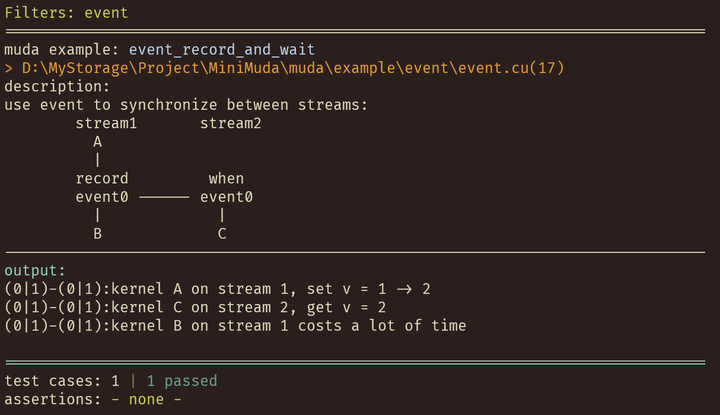
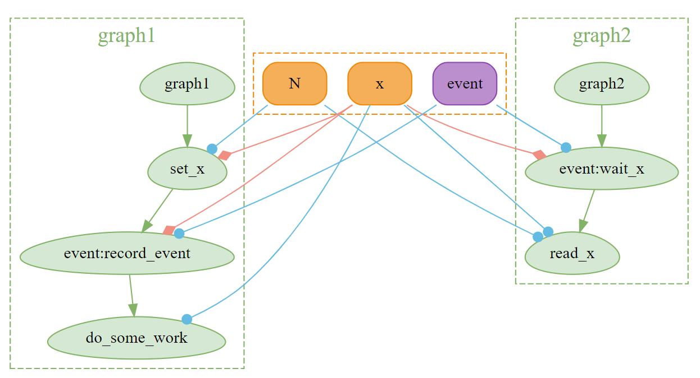
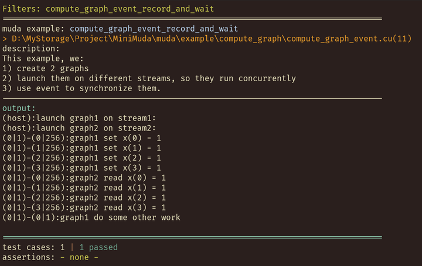

# Event

We will introduce how to use `Event` in MUDA in this article.

> `muda::Event` is a RAII wrapper for `cudaEvent_t`. It creates `cudaEvent_t` when constructed and releases `cudaEvent_t` when destructed. 

Event is mainly used to synchronize tasks on two Streams. When a task on StreamA is completed, we can record an Event, and wait for the Event on StreamB. Then all tasks after the Event in StreamB will wait for the Event to be triggered before starting. 

Let's look at a simple example.

```
        stream1       stream2
          A              
          |              
        record         when 
        event0 ------ event0
          |             |
          B             C
```

On `stream1`, we first launch a task A, record `event0` after A is completed, and then launch task B. On `stream2`, we first wait for `event0`, and then launch task C. 

Obviously, this setting can ensure that A is completed before B and C. 

- B can start after A is completed because A and B are on the same Stream, and they implicitly synchronize on `stream1`. 
- C can start after B is completed because A records an Event, and C waits for the same Event. They explicitly synchronize on `event0`.

## Basic

In MUDA, such relationships can be described very clearly and naturally:

```c++
Stream          s1, s2;
Event           set_value_done;
DeviceVar<int> v = 1;

on(s1) // On Stream1
    .next<Launch>(1, 1)
    .apply(// Task A
        [v = v.viewer()] __device__() mutable
        {
            int next = 2;
            MUDA_KERNEL_PRINT("kernel A on stream 1, set v = %d -> %d", v, next);
            v = next;
        })
    .record(set_value_done) // Record Event：set_value_done
    .apply(// Task B
        [] __device__()
        {
            some_work(); 
            MUDA_KERNEL_PRINT("kernel B on stream 1 costs a lot of time");
        });

on(s2) // On Stream2
    .when(set_value_done) // Wait Event：set_value_done
    .next<Launch>(1, 1) 
    .apply([v = make_viewer(v)] __device__() // Task C
            { MUDA_KERNEL_PRINT("kernel C on stream 2, get v = %d", v); });

// Sync
wait_device();
```

The output is as follows:

{style="display: block; margin: 0 auto" }


## Compute Graph Support

ComputeGraph is an important feature of MUDA, and event recording and waiting are also allowed between ComputeGraphs.

```c++
ComputeGraphVarManager manager;
ComputeGraph graph1{manager, "graph1"};
ComputeGraph graph2{manager, "graph2"};

auto& N     = manager.create_var<size_t>("N");
auto& x     = manager.create_var<BufferView<int>>("x");
// Note: GraphVar type needs to be cudaEvent_t
auto& event = manager.create_var<cudaEvent_t>("event");

graph1.create_node("set_x") << [&] // Task A
{
    ParallelFor(256).apply(N.eval(),
                            [x = x.eval().viewer()] __device__(int i) mutable
                            {
                                x(i) = 1;
                                MUDA_KERNEL_PRINT("graph1 set x(%d) = %d", i, x(i));
                            });
};

graph1.create_node("event:record_event") << [&] { on().record(event, x); }; // Record event

graph1.create_node("do_some_work") << [&] // Task B
{
    Launch().apply(
        // dummy read x, to make sure the kernel is launched after set_x
        [x = x.ceval().cviewer()] __device__() mutable
        {
            some_work();
            MUDA_KERNEL_PRINT("graph1 do some other work");
        });
};

graph2.create_node("event:wait_x") << [&] { on().wait(event, x); }; // Wait event

graph2.create_node("read_x") << [&] // Task C
{
    ParallelFor(256).apply(N.eval(),
                            [x = x.ceval().cviewer()] __device__(int i) mutable {
                                MUDA_KERNEL_PRINT("graph2 read x(%d) = %d", i, x(i));
                            });
};

Stream stream1;
Stream stream2;


auto N_value     = 4;
auto x_value     = DeviceBuffer<int>(N_value);
auto event_value = Event{};

// Update ComputeGraphVar
N     = N_value;
x     = x_value;
event = event_value;

MUDA_KERNEL_PRINT("launch graph1 on stream1:");
graph1.launch(stream1);
MUDA_KERNEL_PRINT("launch graph2 on stream2:");
graph2.launch(stream2);
wait_device();
```

The difference from the basic example is that we use `on().record(event, x)` and `on().wait(event, x)` instead of `on().record(event)` and `on().wait(event)`. Because MUDA ComputeGraph calculates node dependencies based on resource read-write situations, the event also needs to specify the corresponding resource. 

We can visualize these two ComputeGraphs with `manager.graphviz(std::cout)`:

{style="display: block; margin: 0 auto" }


We can see that the two nodes connected by the event both access `x` (both are red arrows). This is because for safety, MUDA Compute Graph Dependency Building must assume that Record and Wait nodes both read and write `x`, so that the generated dependencies are the most conservative.

The result is as follows:

{style="display: block; margin: 0 auto" }


## Note 

When using events between ComputeGraphs, you need to be extra careful. Incorrect event operations may cause data corruption, and this kind of data corruption is something that MUDA ComputeGraph cannot foresee or check (because the event is a dynamic synchronization operation, and this dependency is established when the graph is launched, which cannot be predicted). Events are mainly suitable for streaming models; while ComputeGraph is a graph model, the dependencies between nodes can be considered as events.

## Best Practice

Do not use Event in ComputeGraph unless you are fully aware of the consequences of your behavior. Use `manager.graphviz()` to visualize the ComputeGraph you constructed as much as possible.
