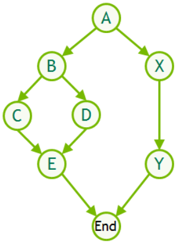
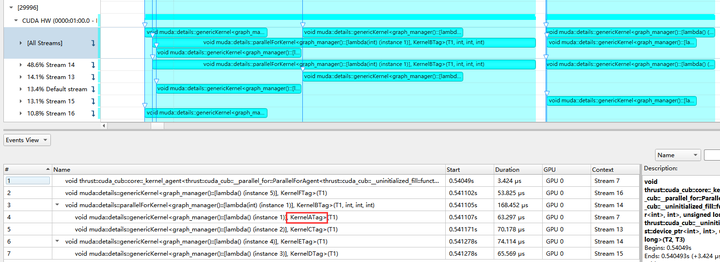

# Compute Graph

Before introducing the automatic compute graph of muda, we need some basic knowledge of cuda graph.

[Getting Started with CUDA Graphs](https://developer.nvidia.com/blog/cuda-graphs/)

{style="display: block; margin: 0 auto"}
*<small style="display: block; margin: 0 auto">compute graph</small>*

In conclusion, a cuda graph is a directed acyclic graph with a fixed topology (of course, the topology is not immutable, it is just that the cost of changing the topology is very high).

The nodes represent various operations: 

- Kernel Launch
- Memcpy/Memset
- Event Record/Event Wait

The directed edges represent the dependency relationship between the nodes, and the branches without dependencies can be parallelized on the GPU (the parallelism here is not the same as the parallelism of threads within the Kernel, the former is a concurrency issue). 

If we correctly set the nodes and dependencies, then a cuda graph is constructed. Using cuda graph has lower startup overhead and higher GPU utilization than directly stuffing all operations into a cuda stream or manually allocating multiple cuda streams for concurrency. 
 
{style="display: block; margin: 0 auto"}
*<small style="display: block; margin: 0 auto">After the cuda graph is launched, multiple streams are automatically allocated for kernel concurrency.</small>*


So far, the dependencies of the cuda graph need to be set manually by the user. When the input variables of the kernel or other operations change, the user needs to update the node parameters manually. When we face a large number of nodes and input parameters, it is not practical to manually construct the cuda graph and update the nodes, so the automatic compute graph of muda comes into being.

## Muda Compute Graph

Here's a simple example of a muda compute graph definition.

```c++
void compute_graph_simple()
{
    ComputeGraphVarManager manager;
    ComputeGraph graph{manager};

    // 1) Define GraphVar
    auto& N   = manager.create_var<size_t>("N");
    // BufferView is a fixed memory
    // GraphVar does not support dynamic memory (DeviceVector/DeviceBuffer, etc. are not accepted)
    auto& x_0 = manager.create_var<BufferView<Vector3>>("x_0");
    auto& x   = manager.create_var<BufferView<Vector3>>("x");
    auto& y   = manager.create_var<BufferView<Vector3>>("y");
    
    // 2) Create GraphNode
    graph.create_node("cal_x_0") << [&]
    {
        // simple initialization
        ParallelFor(256).apply(N.eval(),
                               [x_0 = x_0.viewer()] __device__(int i) mutable
                               { x_0(i) = Vector3::Ones(); });
    };

    graph.create_node("copy_to_x") // copy
        << [&] { BufferLaunch().copy(x.eval(), x_0.ceval()); };

    graph.create_node("copy_to_y") // copy
        << [&] { BufferLaunch().copy(y.eval(), x_0.ceval()); };

    graph.create_node("print_x_y") << [&]
    {
        // print
        ParallelFor(256).apply(N.eval(),
                               [x = x.cviewer(),
                                y = y.cviewer(),
                                N = N.eval()] __device__(int i) mutable
                               {
                                   if(N <= 10)
                                       print("[%d] x = (%f,%f,%f) y = (%f,%f,%f) \n",
                                             i,
                                             x(i).x(),
                                             x(i).y(),
                                             x(i).z(),
                                             y(i).x(),
                                             y(i).y(),
                                             y(i).z());
                               });
    };
    // 3) Generate graphviz code to visualize the dependency graph (optional, for debugging)
    graph.graphviz(std::cout);
}
```

We can paste the generated graphviz code into [Graphviz Online](https://dreampuf.github.io/GraphvizOnline/) to view:

{style="display: block; margin: 0 auto" }

We can see that `copy_to_x` and `copy_to_y` both depend on `cal_x_0`, which is expected because according to our logical order, `x_0` will be initialized first, and then copied to `x` and `y`. There is no dependency between `copy_to_x` and `copy_to_y` because they both only read `x_0`, so their execution can be completely parallel. Then we print `x` and `y`. Since `x` and `y` need to be fully written before printing, `print_x_y` depends on `copy_to_x` and `copy_to_y`.

Besides nodes, we also visualize the read(red)/write(blue) status of each graph node to graph vars.

More specifically:

In 1), we define `graph var`. These graph vars in the muda compute graph only represent a virtual resource (muda compute graph defaults to no overlap between all virtual resources, i.e., memory does not overlap). Generally, we require the input variables of the graph to be a viewer (it does not own resources itself, it is just a resource accessor, and is trivially copyable), or a value type. If you know what you are doing, you can also use some tricks.


Here we can give some examples of STL to illustrate what kind of object is a viewer, and what kind of object is not a viewer:

- `std::vector` is not a viewer because it is a container with memory ownership.
- `std::span` is a viewer because it is not a container, it is just a slice of a container.
- `std::string` is not a viewer because it is a container with memory ownership.
- `std::string_view` is a viewer because it is not a container, it is just a slice of a container.

Of course, the so-called viewer cannot be accessed on the GPU, and muda requires that the viewer can be accessed on the host or device.

In 2), we define the graph nodes. Note that the definition order of graph nodes will affect the dependency relationship of graph nodes. The definition order of graph nodes should be the logical order of all tasks, which is very intuitive! All our serial code is written like this.

Let's look at the first graph node:

```c++
graph.create_node("cal_x_0") << [&] // lambdaB
{
    ParallelFor(256).apply(N.eval(),
                           [x_0 = x_0.viewer()] __device__(int i) mutable // lambdaA
                           {
                               x_0(i) = Vector3::Ones();
                           });
};
```

The innermost lambdaA is a muda-style kernel call, nothing special.

The outermost lambdaB is called a graph node closure, which is a closure of a node construction process. This closure may be called multiple times throughout the life cycle of the graph, such as:

- **Graph topology build**: the phase of computing the graph dependency topology, during this phase, muda compute graph only constructs the dependency relationship and does not actually generate the cuda graph.
- **Graph build**: the phase of building the cuda graph, during this phase, the cuda graph is directly generated.
- **Graph update**: the phase of updating node parameters, when a graph var referenced by the user is updated, all nodes referencing this graph var need to update the parameters.
- **Graph direct launch**: muda compute graph direct call mode. At this time, all nodes are called serially on a cuda stream, generally used for debugging and profiling a graph.

Calling these closures in different life cycle stages may use different underlying CUDA APIs.

In the topology build phase, no CUDA API is called, only the `graph var`'s eval and ceval are responded to. By setting the properties of `eval=ReadWrite` and `ceval=ReadOnly`, we can mark the resource usage for the current node, which will be used to generate node dependency relationships.

In the build phase, muda calls all graph node closures, which will call the `cudaGraphNodeCreate` series of APIs to generate cuda graph nodes, and then muda will supplement the dependencies in the cuda graph according to the dependencies generated in the topology build phase.

In the graph update phase, the graph node closure corresponding to the node that needs to be updated will be called again (minimum update), and the cuda graph node parameters will be updated by calling the `cudaGraphExecSetParameter` series of APIs.

In the graph direct launch phase, the most primitive cuda launch and runtime APIs are used, such as the classic triple angle brackets `<<<>>>` call, `cudaMemcpy`, etc.

After that, we need to prepare to call this compute graph.


```c++
void compute_graph_simple()
{
    ...
    graph.graphviz(std::cout);

    // Allocate resources
    auto N_value    = 10;
    auto x_0_buffer = DeviceBuffer<Vector3>(N_value);
    auto x_buffer   = DeviceBuffer<Vector3>(N_value);
    auto y_buffer   = DeviceBuffer<Vector3>(N_value);
    
    // Update graph var
    // we need to use update() to pass in the corresponding resources, 
    // because we only defined the resources before and did not really input the resources into the graph
    N.update(N_value);
    x_0.update(x_0_buffer);
    x.update(x_buffer);
    y.update(y_buffer);
    
    graph.launch();
}
```

Ouptut:

```
[0] x = (1.000000,1.000000,1.000000) y = (1.000000,1.000000,1.000000)
[1] x = (1.000000,1.000000,1.000000) y = (1.000000,1.000000,1.000000)
[2] x = (1.000000,1.000000,1.000000) y = (1.000000,1.000000,1.000000)
[3] x = (1.000000,1.000000,1.000000) y = (1.000000,1.000000,1.000000)
[4] x = (1.000000,1.000000,1.000000) y = (1.000000,1.000000,1.000000)
[5] x = (1.000000,1.000000,1.000000) y = (1.000000,1.000000,1.000000)
[6] x = (1.000000,1.000000,1.000000) y = (1.000000,1.000000,1.000000)
[7] x = (1.000000,1.000000,1.000000) y = (1.000000,1.000000,1.000000)
[8] x = (1.000000,1.000000,1.000000) y = (1.000000,1.000000,1.000000)
[9] x = (1.000000,1.000000,1.000000) y = (1.000000,1.000000,1.000000)
```

`graph.launch()` means that the graph will be synchronized on the default stream, and the graph will wait for all tasks in the default stream to complete before starting to run, and all tasks after the graph on the default stream will wait for the current graph to complete.

`graph.launch(stream)` means that the graph will be synchronized on this stream.

In addition, we also provide another launch method: `graph.launch(single_stream=true, stream)`. When `single_stream=true`, the graph will not be called through the cuda graph, but will directly call all nodes in the order of `graph.create_node` on the stream. This will be beneficial for debugging and profiling. In theory, if there is no floating-point calculation problem, the final results of all the above calling methods should be consistent.

## Limitation

Now the graph node closure allows capturing references, which may cause side effects when the user makes a mistake, resulting in different results when calling the closure multiple times.
