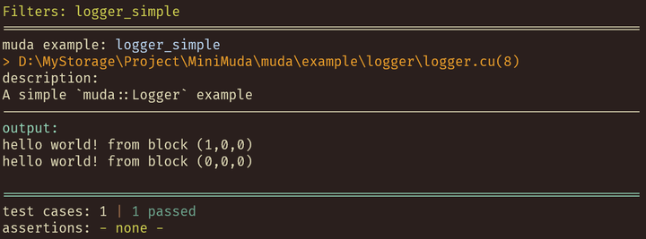
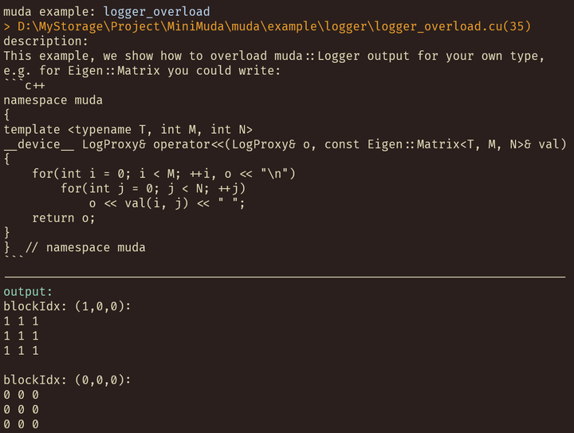
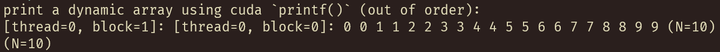
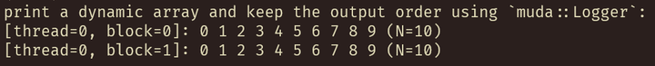

# Logger

We will introduce the usage of muda's `Logger` object in this article. Have you ever had the experience of printing a matrix in the kernel? It will be like this:

```c++
printf(
"%f %f %f %f \n"
"%f %f %f %f \n"
"%f %f %f %f \n"
"%f %f %f %f \n",
m[0][0], m[0][1], m[0][2], m[0][3],
m[1][0], m[1][1], m[1][2], m[1][3],
m[2][0], m[2][1], m[2][2], m[2][3],
m[3][0], m[3][1], m[3][2], m[3][3]);
```

It is so painful. This is just a `Matrix4x4`. To solve this pain point, `muda::Logger` provides a way to print similar to `std::cout`.

## Muda Logger

```c++
using namespace muda;
void logger_simple()
{
    Logger logger;
    Launch(2, 1)
        .apply(
            [logger = logger.viewer()] __device__() mutable
            {
                //print hello world
                logger << "hello world! from block (" << blockIdx << ")\n";
            })
        .wait();
    logger.retrieve(std::cout);
}
```
First we create a `logger` like defining `DeviceBuffer`, then get the viewer of the logger. So we can use the logger in the kernel like using `std::cout << "foo"`. When we need to take out the content printed in the kernel, we need to call `logger.retrieve(...)` to manually write the content recorded in the logger to any `ostream`. Here we directly use `std::cout` as the output stream. 

The running result is:

{style="display: block; margin: 0 auto" }

The advantage of `muda::Logger` is that we can overload the `<<` operator to output any data the user wants. 

For example, if you want to unify the output of all `Eigen::Matrix` types, you can operate like this:

```c++
namespace muda
{
template <typename T, int M, int N>
__device__ LogProxy& operator<<(LogProxy& o, const Eigen::Matrix<T, M, N>& val)
{
    for(int i = 0; i < M; ++i, o << "\n")
        for(int j = 0; j < N; ++j)
            o << val(i, j) << " ";
    return o;
}
}  // namespace muda

void logger_overload()
{
    Logger logger;
    Launch(2, 1)
        .apply(
            [logger = logger.viewer()] __device__() mutable
            {
                Eigen::Matrix3f ones =
                    Eigen::Matrix3f::Ones() * static_cast<float>(blockIdx.x);
                logger << "blockIdx: (" << blockIdx << "):\n" << ones << "\n";
            })
        .wait();
    logger.retrieve(std::cout);
}
```

We overloaded the `__device__ LogProxy& operator << (LogProxy& o, ...)` function in the `muda` namespace, so that the logger can recognize the type we want to output, and then define the output format as we did with `operator std::ostream& operator << (std::ostream&, ...)`. After that, we can directly print any `Eigen::Matrix` in the kernel.

You may wonder why the overloaded object is `LogProxy` instead of `LoggerViewer`. This question will be explained to you later in this article.

The running result is:

{style="display: block; margin: 0 auto" }


## Print Dynamic Array 

What can `muda::Logger` do that `printf` cannot do? Try this!

```c++
void logger()
{
    std::vector<int> host_array(10);
    std::iota(host_array.begin(), host_array.end(), 0);
    DeviceBuffer<int> dynamic_array;
    dynamic_array = host_array;

    std::cout << "print a dynamic array using cuda `printf()` (out of order):\n";
    Launch(2, 1)
        .apply(
            [dynamic_array = dynamic_array.viewer()] __device__() mutable
            {
                printf("[thread=%d, block=%d]: ", threadIdx.x, blockIdx.x);
                for(int i = 0; i < dynamic_array.dim(); ++i)
                    printf("%d ", dynamic_array(i));
                printf("(N=%d)\n", dynamic_array.dim());
            })
        .wait();
}
```

It looks plain, just print `dynamic_array` one by one. But what is the result?

{style="display: block; margin: 0 auto" }

It is quite bad, because different threads are printing at the same time, we cannot prevent other threads from interrupting the current output, so what we finally see is the alternating output of different threads. 

Using `muda::Logger`?

```c++
void logger()
{
    std::vector<int> host_array(10);
    std::iota(host_array.begin(), host_array.end(), 0);
    DeviceBuffer<int> dynamic_array;
    dynamic_array = host_array;

    std::cout << "print a dynamic array and keep the output order using `muda::Logger`:\n";
    Logger logger;
    Launch(2, 1)
        .apply(
            [logger = logger.viewer(), dynamic_array = dynamic_array.viewer()] __device__() mutable
            {
                LogProxy proxy{logger};
                proxy << "[thread=" << threadIdx.x << ", block=" << blockIdx.x << "]: ";
                for(int i = 0; i < dynamic_array.dim(); ++i)
                    proxy << dynamic_array(i) << " ";
                proxy << "(N=" << dynamic_array.dim() << ")\n";
            })
        .wait();
    logger.retrieve(std::cout);
}
```

{style="display: block; margin: 0 auto" }

Good! It meets our expectations.

In the `muda::Logger` system, `LogProxy` can be constructed from a `LoggerViewer`, which is a very simple object. The object sequence written to `LogProxy` will not be interrupted by other threads. 

In the example above, we printed a dynamic array in a very cumbersome way. In fact, this cumbersome process can be encapsulated into an overload of `__device__ LogProxy& operator << (LogProxy& o, ...)`, just like we printed `Eigen Matrix` before.

## Implementation Details

From this section, we will briefly introduce the implementation details of `muda::Logger`. If you are not interested in this part, you can skip it boldly.

The `muda::Logger` system separates the `push data` and `format` processes: 

- `push data` refers to separating the output object into basic types and pushing them to a specific log buffer. In this process, we do not convert the object into a string. 
- `format` refers to converting basic types into formatted strings. 

The push data process is completed in the GPU Kernel, and the format process is completed on the CPU (more specifically, we complete it when we call `logger.retrieve()`).

Though the push data process is atomic, we cannot guarantee that the push data process of different threads will not be interrupted. For example, the dynamic array printing example above. To solve this problem, we can record an ID when pushing data. This ID is called `LogProxyID`, which increases with the construction of the `LogProxy` object. We call the combination of "basic type bytecode + LogProxyID" `LoggerMetaData`. In this way, we know which `LogProxy` the basic type belongs to when we get each basic type.

Later, we only need to perform a stable sort on `LoggerMetaData` when calling `logger.retrieve()` to restore the print order. For performance reasons, this `Stable Sort` uses `cub::DeviceRadixSort` (on the GPU) instead of `std::stable_sort`.

## Summary

1. `muda::Logger` allows us to format output objects in the Kernel using `<<` and allows us to overload the format output.`
2. `LogProxy` allows us to continuously output a dynamic array and keep the output process uninterrupted.
3. `muda::Logger` allows us to send the output result to any `std::ostream`.

## Limitations

But `muda::Logger` has a fatal flaw: 

When a cuda error occurs, if the cuda device cannot be recovered, the content printed in the Kernel cannot be retrieved. But `printf` can print output before the cuda device fails.
